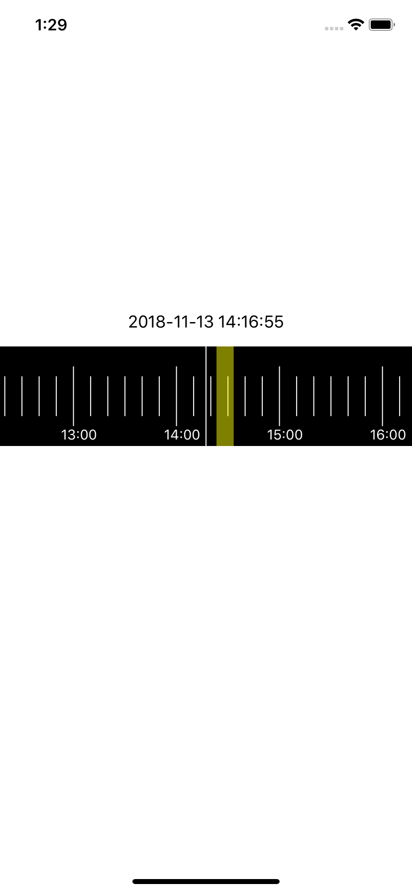
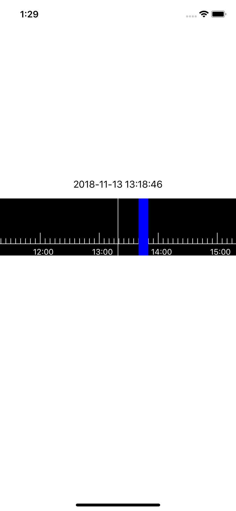

# 录像时间轴 [TimeAxis](https://github.com/DanielHusx/TimeAxis)

- 录像时间轴，无限滚动
- 可扩展自定义绘制方法
- 使用物理引擎UIDynamic模拟实现UIScrollView的滚动减速效果
- 提供丰富的回调反馈，可以详细查看DHTimeAxisDelegate


###快速集成

```shell
pod 'TimeAxis'
or
$git clone https://github.com/DanielHusx/TimeAxis.git
```


###使用示例

```objective-c
#import <DHTimeAxis.h>

    /**
    DHTimeAxisAppearance是个单例类，用于控制外观属性，具体属性请查看该类
    其中属性rendererClass 必须是继承DHTimeAxisRenderer的子类，
    它是能够使用DHTimeAxisAppearance属性进行绘制的类，具体使用方式可以参照DHTimeAxisGearRenderer或DHTimeAxisRuleRenderer的实现
    */
    [DHTimeAxisAppearance renderGearAppearanceWithDirection:DHAxisDirectionHorizontal];

    DHTimeAxis *axis = [[DHTimeAxis alloc] initWithFrame:CGRectMake(0, self.view.frame.size.height/2.0-100, self.view.frame.size.width, 100)];
    axis.delegate = self
    [self.view addSubview:axis];

```

###丰富的回调
```objective-c
@class DHTimeAxis;
@protocol DHTimeAxisDelegate <NSObject>
@optional
/// 更新当前时间
- (void)timeAxis:(DHTimeAxis *)timeAxis didChangedTimeInterval:(NSTimeInterval)currentTimeInterval;
/// 更新放缩比例
- (void)timeAxis:(DHTimeAxis *)timeAxis didChangedScale:(CGFloat)currentScale;
/// 停止的位置存在数据
- (void)timeAxis:(DHTimeAxis *)timeAxis didEndedAtDataSection:(DHTimeAxisData *)aAxisData;
/// 开始滚动
- (void)timeAxisDidBeginScrolling:(DHTimeAxis *)timeAxis;
/// 结束滚动
- (void)timeAxisDidEndScrolling:(DHTimeAxis *)timeAxis;
/// 开始捏合手势
- (void)timeAxisDidBeginPinching:(DHTimeAxis *)timeAxis;
/// 结束捏合手势
- (void)timeAxisDidEndPinching:(DHTimeAxis *)timeAxis;
/**
 外部提供偏移当前时间参数 的计算方法
 @param offset 手势造成的偏移
 @param viewSize 视图长宽
 @param opOffset 计算后的偏移值
 @param opViewSize 计算后的尺寸
 */
- (void)translationCurrentTimeIntervalFromOffset:(CGPoint)offset viewSize:(CGSize)viewSize toOptimisticOffset:(CGFloat *)opOffset optimisticViewSize:(CGFloat *)opViewSize;
@end
```

###绘制方法：
自定义绘制方法只需要三步：
1. 继承DHTimeAxisRenderer类并实现如下方法，具体实现内容可以参考DHTimeAxisGearRenderer类和DHTimeAxisRuleRenderer类
```objective-c
/// 绘制数据
- (void)visitTimeAxisData:(DHTimeAxisData *)aTimeAxisData;
/// 绘制刻度线
- (void)visitTimeAxisRule:(DHTimeAxisRule *)aTimeAxisRule;
/// 绘制基线
- (void)visitTimeAxisBaseLine:(DHTimeAxisBaseLine *)aTimeAxisBaseLine;
/// 绘制数字与分割线
- (void)visitTimeAxisDigitalDivision:(DHTimeAxisDigitalDivision *)aTimeAxisDigitalDivision;
/// 绘制背景
- (void)visitTimeAxisBackground:(DHTimeAxisBackground *)aTimeAxisBackground;


// 另外需要根据对应数据更新的话，可继承如下方法，务必调用super
- (void)updateValueWithTimeAxisRule:(DHTimeAxisRule *)aTimeAxisRule;
- (void)updateValueWithTimeAxisBaseLine:(DHTimeAxisBaseLine *)aTimeAxisBaseLine;
- (void)updateValueWithTimeAxisDigitalDivision:(DHTimeAxisDigitalDivision *)aTimeAxisDigitalDivision;
- (void)updateValueWithTimeAxisBackground:(DHTimeAxisBackground *)aTimeAxisBackground;
```
2. 设置`[DHTimeAxisAppearance sharedAppearance].rendererClass`为自定义类名
3. 调用更新DHTimeAxis的更新方法

```objective-c
// 更新方法
[timeAxis updateAppearance];
```


###效果图
####DHTimeAxisGearRenderer



<<<<<<< HEAD
####DHTimeAxisRuleRenderer

=======

>>>>>>> f3446d383d95da4b79fc0ca066fc4a8cfff9a58c
